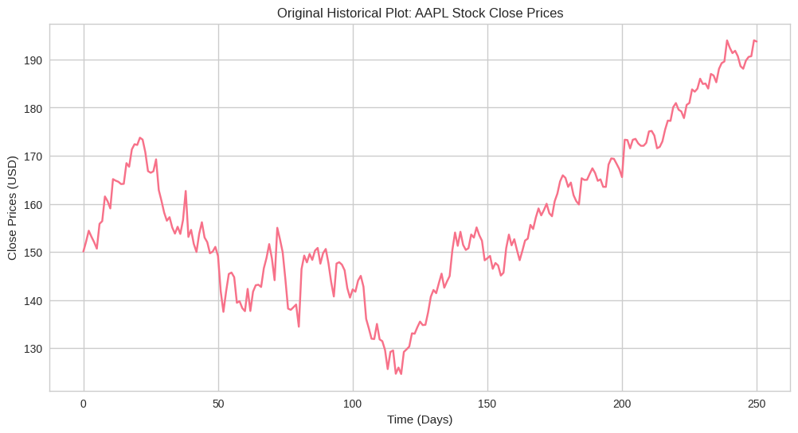
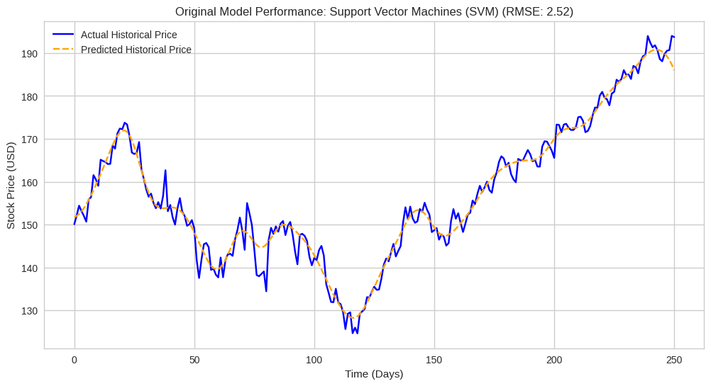
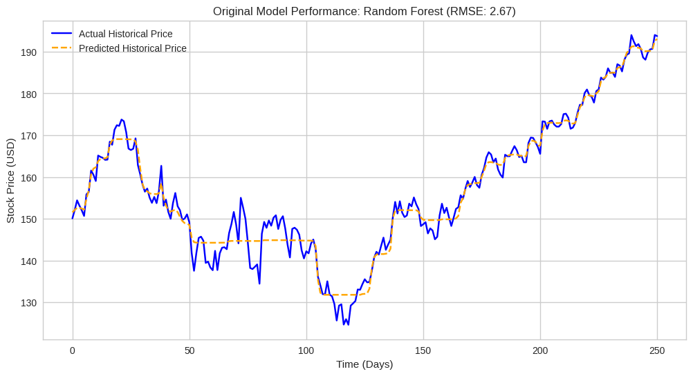
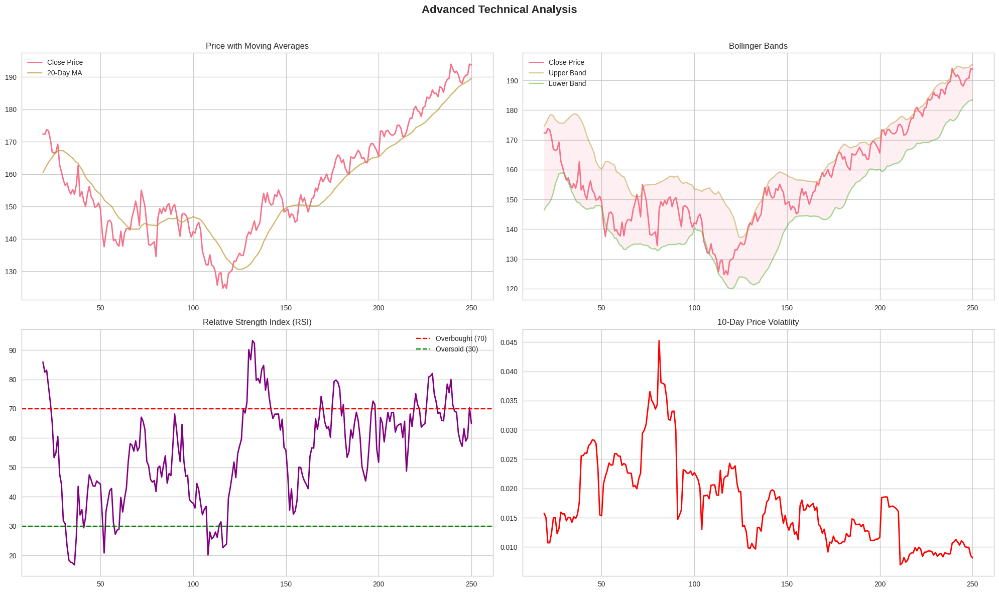
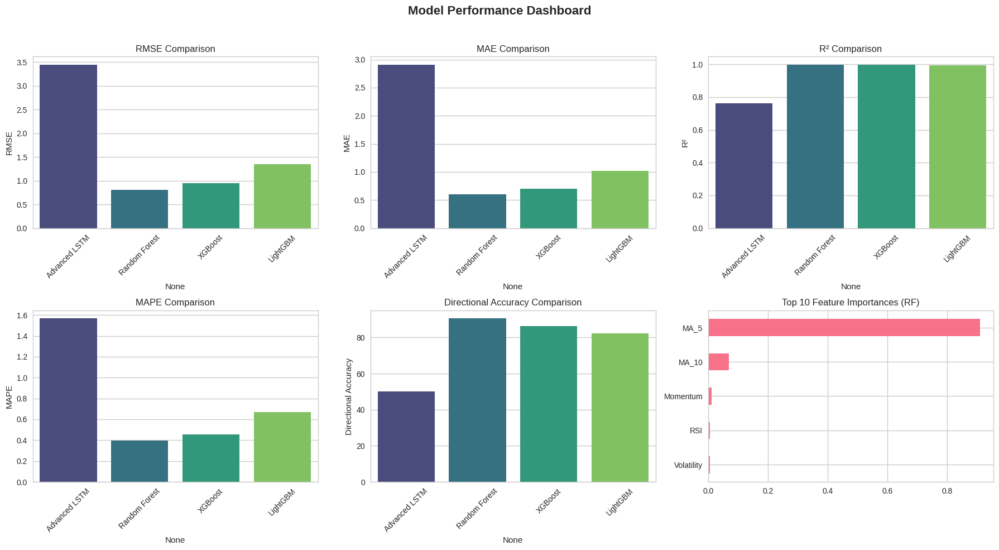
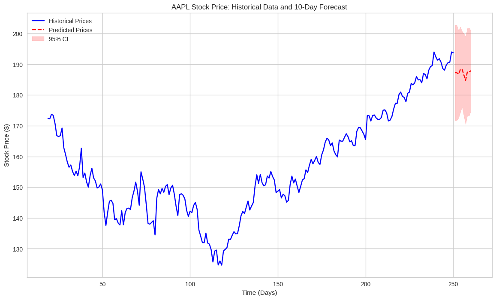

# Advanced Stock Predictor 📈

  

## Overview

This project provides a comprehensive suite for stock price prediction, evolving from simple, single-feature models to an advanced, multi-feature forecasting system. It demonstrates a full data science workflow, including data preprocessing, extensive feature engineering, model training, hyperparameter tuning, and robust evaluation. The final output is a 10-day forecast complete with confidence intervals to quantify uncertainty.

---

## Key Features

- **Dual Analysis Pipeline:** Executes both a **simple analysis** (using only historical prices) and an **advanced analysis** (using over 10 engineered features).
- **Extensive Feature Engineering:** Creates technical indicators like Moving Averages (SMA), RSI, Bollinger Bands, MACD, Volatility, and Momentum.
- **Diverse Model Training:**
  - **Simple Models:** Trains individual SVM, Random Forest, XGBoost, LightGBM, and a basic LSTM on historical close prices.
  - **Advanced Models:** Trains the same models on the full suite of engineered features for improved performance.
- **Advanced Forecasting:** Utilizes a stacked LSTM with Monte Carlo dropout to generate a 10-day forecast with a **95% confidence interval**.
- **Comprehensive Visualization:** Automatically generates:
  - Original model performance plots.
  - A technical analysis dashboard.
  - A final performance dashboard comparing advanced models on metrics like RMSE, MAE, R², and Directional Accuracy.
  - The final forecast plot showing historical data vs. future predictions.

---

## Results and Visualizations

### 1. Original Analysis Results

The initial analysis used only historical close prices to train the models.

**Original Historical Data**


**Original SVM Performance**


**Original Random Forest Performance**


**Original XGBoost Performance**


**Original LightGBM Performance**


**Original LSTM Historical Fit**


### 2. Advanced Analysis Results

The advanced analysis used a rich set of engineered features to improve model accuracy.

**Advanced Technical Analysis Dashboard**


**Advanced Model Performance Dashboard**


**Final 10-Day Forecast with Confidence Interval**


---

## How to Run

**1. Clone the repository:**
```bash
git clone [https://github.com/YOUR_USERNAME/Advanced-Stock-Predictor.git](https://github.com/YOUR_USERNAME/Advanced-Stock-Predictor.git)
cd Advanced-Stock-Predictor
```

**2. Create a virtual environment and install dependencies:**

```bash
python -m venv venv
source venv/bin/activate  # On Windows, use `venv\Scripts\activate`
pip install -r requirements.txt
```

**3. Run the script:**

```bash
python main.py
```

The script will run the full pipeline and generate all plots.